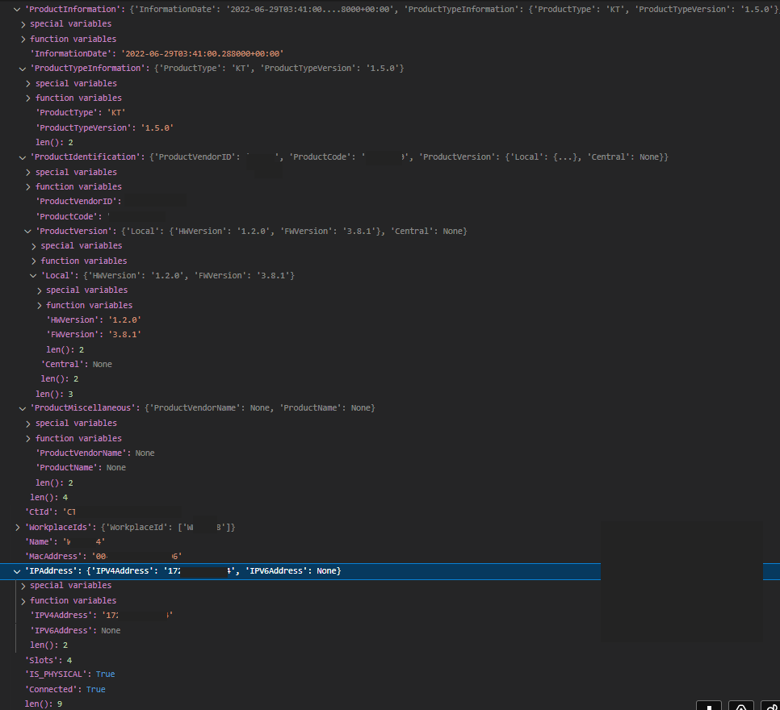

# FRAGEN

(Eigene Fragen/Überlegungen als [Issue](https://github.com/elabit/checkmk_gematik_tikonn/issues) stellen oder per [Pull Request](https://github.com/elabit/checkmk_gematik_tikonn/pulls) direkt in  aufnehmen)

- Der Agent wurde gegen die Spezifikation der Gematik entwickelt, jedoch nur mit "kocobox"-Konnektoren getestet.  
🙋‍♂️ **Funktioniert er auch mit Geräten von RISE und Secunet?**
- Der Agent wurde im Code (und auch im Web-Setup) darauf vorbereitet, gleichzeitig mit verschiedenen WSDL-Versionen umgehen zu können.  
🙋‍♂️ **Welche Versionen sind da draußen im Einsatz**? 
- Je Konnektor werden auch die zugehörigen Kartenterminals (durch den DCD) angelegt.  
🙋‍♂️ **Ist es hilfreich, auch die Kartenterminals im Monitoring zu haben? Aktuell wird nur ein informeller Check "SysInfo" generiert - welche Checks könnten noch nützlich sein?**  (siehe Dump der Datenstruktur unten)
🙋‍♂️ **Wie gelingt es, die Kartenterminals mit IP-Adresse anzulegen? (Das wird vom DCD nativ nicht unterstützt)**
- Aktuell sind keine Tests implementiert. **Wer kann diese beisteuern?**
- **Welche anderen Features bzw. Werte könnten noch implementiert werden?**
- Ist es ggf. notwendig, einzelne Kertenterminals zu blacklisten? 

## Appendix

### Kartenterminal-Info 

