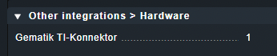
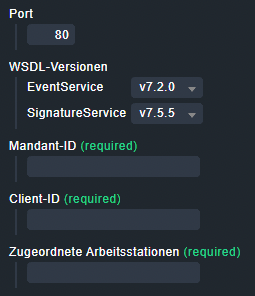
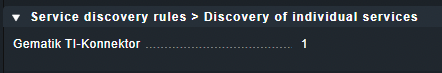
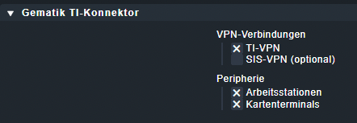

# Checkmk Monitoring für Gematik TI-Konnektoren

## Beschreibung 

Mit diesem Checkmk-Special-Agent können [Gematik](https://gematik.de)-kompatible TI-Konnektoren (z.b. "kocobox") überwacht werden. 

Der Agent wurde für das [Krankenhaus des Landkreises Weilheim-Schongau](https://www.meinkrankenhaus2030.de) entwickelt und unter der GPLv3 veröffentlicht. Die Zuständigkeit für Bugfixes und Weiterentwicklung wurde an die [ELABIT GmbH](https://elabit.de) delegiert.

## Features

* Überwachung des internen Eventlogs (z.b. Firmware-Aktualität, Verbindung zum Kartenterminal etc.)
* VPN-Verbindungsstatus 
  - TI (Technishce Infrastruktur)
  - SIS (Sicherer Internetservice)
* Arbeitsstationen, die an diesem Konnektor angeschlossen sind
* Kartenterminals, die an diesem Konnektor konfiguriert sind. Diese werden bei entsprechend eingerichtetem DCD automatisch als Hosts in Checkmk angelegt. 

## DISCLAIMER

🏗 = WIP / TO DISCUSS

⚠️ Dieser Special Agent ist noch im Beta-Stadium und nicht für den produktiven Betrieb freigegeben.

⚠️ This Special Agent is still in beta and not released for production use.
## Voraussetzungen und Installation 
### Python-Modul "zeep"

Die Kommunikation mit der SOAP-Schnittstelle der Konnektoren erfolgt über das [Zeep-Modul](https://docs.python-zeep.org/en/master/) für Python3.

Dieses Modul ist nicht in Checkmk enthalten und muss nachinstalliert werden: 

- In den Kontext des CMK-Site-Users wechseln
- Mit dem nachfolgenden Befehl das Zeep-Modul incl. Abhängigkeiten installieren (Ziel ist das für solche Installation vorgesehene Verzeichnis `$OMD_ROOT/local/lib/python3/`.

```bash
OMD[testsite]:~$ python3 -m pip install zeep
```
### WSDL 

Der Special Agent benötigt zur Kommunikation mit der SOAP-Schnittstelle ferner eine WSDL-Servicebeschreibung.

Die Konnektoren liefern diese WSDL _nicht_ selbst aus; sie muss vom Github-Repo der Gematik (https://github.com/gematik/api-telematik) geclont und in der Checkmk-Site abgelegt werden: 

```bash
OMD[testsite]:~$ cd local/lib
OMD[testsite]:~$ mkdir wsdl && cd wsdl
OMD[testsite]:~$ git clone https://github.com/gematik/api-telematik
```

(👉 der Ordner unterhalb von `wsdl` muss `api-telematik-OPB4` lauten.)

Welche WSDL-Versionen die Konnektoren jeweils erwarten, ist in `http://$KONNEKTOR_IP/connector.sds` einzusehen. Aktuell verwendet der Agent nur folgenden Service: 

- EventService: v7.2
### Installation des Packages 

Wie gewohnt über den MKP-Installationsmechanismus von Checkmk. Installiert werden: 

- Special Agent: `local/share/check_mk/agents/special/agent_gematik_tikonn`
- Check (Trigger f. Special Agent): `local/share/check_mk/checks/agent_gematik_tikonn`
- WATO: 
  - Datasource-Konfiguration: `local/share/check_mk/web/plugins/wato/datasource_gematik_tikonn.py` 
  - Check-Konfiguration: `local/share/check_mk/web/plugins/wato/check_parameters_gematik_tikonn.py`
  - Discovery: `local/share/check_mk/web/plugins/wato/discovery_gematik_tikonn.py`
- Check Plugin: `local/lib/python3/cmk/base/plugins/agent_based/gematik_tikonn.py`

## Betrieb 

Die Regeln des Checks sind am einfachsten per Regelsuche nach "gematik" zu finden.
### Datasource-Regel

Die Datasouce-Regel ist auf je einen (1) Konnektor zu beschränken (Condition: "Explicit hosts")






Zum Abruf der Konnektor-internen Daten wie VPN-Status und Logs wird ein sogenannter "Kontext" benötigt, bestehend aus 

- Mandant-ID
- Client-ID 
- einem Arbeitsstations-Namen. 
  
Um an die Arbeitsstationen angeschlossene Peripherie (z.b. Kartenterminals) zu überwachen, muss der jeweils zur Arbeitsstation passende Kontext übergeben werden. Deshalb ist die Liste der Arbeitsstationen ein Listenfeld. Es wird empfohlen, hier alle Stationen anzugeben. 

🏗 Es ist vorgesehen, die Version einer WSDL anzugeben (falls Geräte mit unterschiedlichen Versionsständen vorhanden sind).  
🏗 `SignatureService` ist lediglich ein Platzhalter für evtl. weitere Abfragen anderer SOAP-Services. 


### Discovery-Regel

Diese Regel kann ggf. für alle Konnektoren gleich eingerichtet werden.






Nach Einrichtung dieser beiden Regeln können die Konnektoren inventarisiert werden. 
### Logs / Events 

Aktive Log-Events werden Konnektor-intern mit einem Flag "valid=True" markiert. 

Um zu vermeiden, dass der Special Agent bei jedem Aufruf immer wieder die gleichen  aktiven Events ausgibt, protokolliert er aktive und neue Events mit einer Temp-Datei im Ordner `$OMD_ROOT/tmp/check_mk/special_agent_gematik_connector/`: 

```bash
-rw-rw----  1 kocobox kocobox   0 Sep 22 11:10 event_1b2458_ec_log_overflow
-rw-rw----  1 kocobox kocobox   0 Sep 22 11:10 event_3aca96_ec_cardterminal_not_availablect_id_0093
-rw-rw----  1 kocobox kocobox   0 Sep 22 11:10 event_ce2935_ec_connector_software_out_of_date
-rw-rw----  1 kocobox kocobox   0 Sep 22 11:10 event_e3dd21_ec_other_error_state2
```

Auf diese Weise wird ein neues Event nur noch 1x ausgegeben; aktive Events, für die bereits eine Datei existiert, werden in der Anzeige unterdrückt. Sobald der Konnektor ein Event als inaktiv flaggt, wird die Protokolldatei wieder entfernt. 

Der Log-Check in Checkmk kann bei Bedarf so konfiguriert werden, dass er die Events in die Eventconsole (EC) weiterleitet, wo dann je nach Meldung unterschiedliche Teams benachrichtigt werden können. 

---

## Glossar

- **Gematik GmbH** (*Gesellschaft für Telematikanwendungen der Gesundheitskarte*) - staatliche Gesellschaft, um gemäß gesetzlichem Auftrag die Einführung, Pflege und Weiterentwicklung der elektronischen Gesunheitskarte und ihrer Infrastruktur in DE voranzutreiben und die Interoperabilität der beteiligten Komponenten sicherzustellen. 
- **Konnektor** = "Gatekeeper" der Telematik-Infrastruktur. Hardwarekomponente, welche die IT der Leistungserbringer über ein Transportnetz (Internet + VPN) mit der Telematikinfrastruktur verbindet. Aufgaben sind u.a.: 
  - VPN-Aufbau
  - Zugriff auf Smartcards in an geschlossenen stationären Kartenterminals
  - Unterscheidung nach Produkttypversionen (PTV1, 3, 4, ...)
  - Zugelassene Hersteller für Konnektoren: secunet, RISE und KoCo Connector GmbH
- **Primärsysteme** = dezentrale Clientsysteme beim Leistungserbringer, unterschieden in die Systeme für
  - Praxisverwaltung (PVS)
  - Apothekenverwaltung (AVS)
  - Krankenhausinformation (KIS)
  - Laborinformation (LIS)

## Weiterführende Informationen

### Hersteller


### Dokumente

- Koco Connector GmbH: https://www.kococonnector.com
  - Administrator-Handbücher Kocobox: https://www.kococonnector.com/deu_de/downloads/kocobox-med.html
    - v4.2.16
    - v2.3.24
- Gematik 
  - Konnektor-info allgemein: https://fachportal.gematik.de/hersteller-anbieter/komponenten-dienste/konnektor
  - Spezifikation Konnektor: https://www.ina.gematik.de/standard/formhandler/324/gemSpec_Kon_V5_8_0.pdf
  - Implementierungsleitfaden: https://fachportal.gematik.de/fachportal-import/files/gemILF_PS_V2.14.0.pdf
  - Forum: https://fachportal.gematik.de
  - Telematik Github Repo der Gematik: https://github.com/gematik/api-telematik

