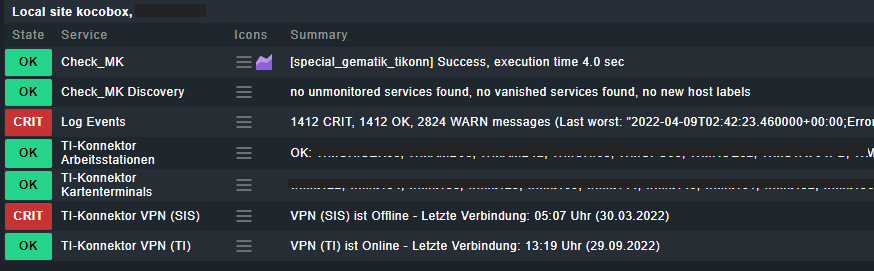
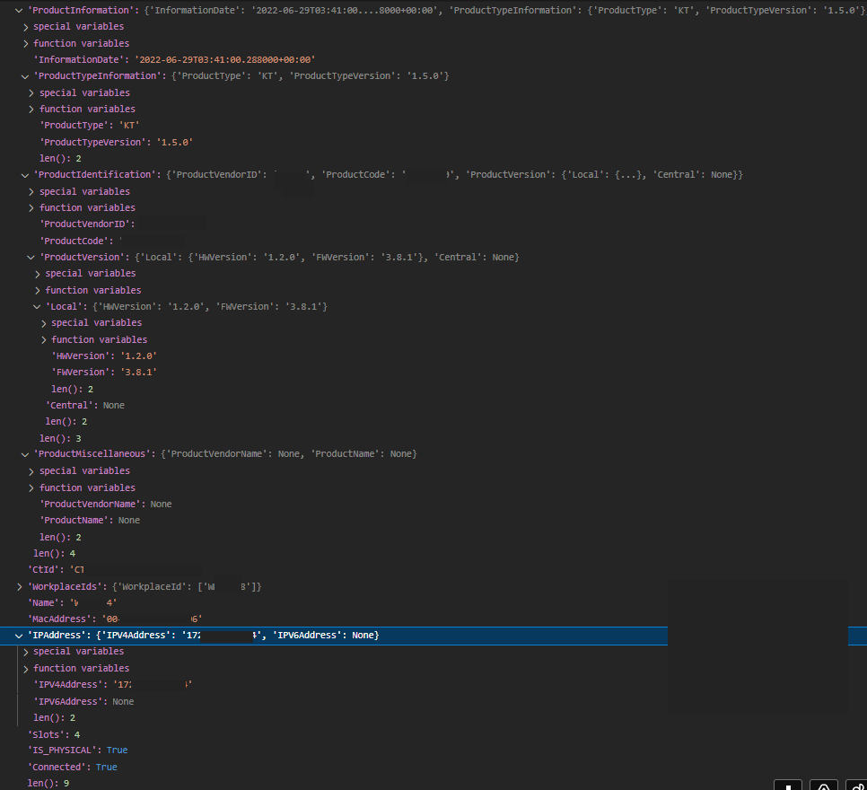

# Checkmk Monitoring für Gematik TI-Konnektoren

START HERE 👉 https://forms.gle/13fGKvo98pCev1Cs9


## Beschreibung 

Mit diesem Checkmk-Special-Agent können [Gematik](https://gematik.de)-kompatible TI-Konnektoren (z.b. "kocobox") überwacht werden. 


Der Agent wurde vom [Krankenhaus des Landkreises Weilheim-Schongau](https://www.meinkrankenhaus2030.de) in Auftrag gegeben und unter der GPLv3 veröffentlicht. Verantwortlich für die Entwicklung ist die [ELABIT GmbH](https://elabit.de).

## Inhalt 

<!--ts-->
* [Checkmk Monitoring für Gematik TI-Konnektoren](#checkmk-monitoring-für-gematik-ti-konnektoren)
   * [Beschreibung](#beschreibung)
   * [Inhalt](#inhalt)
   * [Features](#features)
   * [DISCLAIMER](#disclaimer)
   * [Tester gesucht! <g-emoji class="g-emoji" alias="man_scientist" fallback-src="https://github.githubassets.com/images/icons/emoji/unicode/1f468-1f52c.png">👨‍🔬</g-emoji>](#tester-gesucht-)
   * [DEVELOPMENT](#development)
   * [Voraussetzungen und Installation](#voraussetzungen-und-installation)
      * [Python-Modul "zeep"](#python-modul-zeep)
      * [WSDL](#wsdl)
      * [Installation des MKPs](#installation-des-mkps)
   * [Betrieb](#betrieb)
      * [Datasource-Regel](#datasource-regel)
      * [Discovery-Regel](#discovery-regel)
      * [Logs / Events](#logs--events)
      * [DCD / Kartenterminals](#dcd--kartenterminals)
   * [Glossar](#glossar)
   * [Weiterführende Informationen](#weiterführende-informationen)
      * [Hersteller](#hersteller)
      * [Dokumente](#dokumente)
   * [CREDITS](#credits)

<!-- Created by https://github.com/ekalinin/github-markdown-toc -->
<!-- Added by: runner, at: Thu Oct 20 21:25:32 UTC 2022 -->

<!--te-->


## Features



* Überwachung des internen Eventlogs (z.b. Firmware-Aktualität, Verbindung zum Kartenterminal etc.)
* VPN-Verbindungsstatus 
  - TI (Technische Infrastruktur)
  - SIS (Sicherer Internetservice)
* Arbeitsstationen, die an diesem Konnektor angeschlossen sind
* Kartenterminals, die an diesem Konnektor konfiguriert sind. Diese werden bei entsprechend eingerichtetem DCD automatisch als Hosts in Checkmk angelegt. 

---

## DISCLAIMER

⚠️ Dieser Special Agent ist noch im Beta-Stadium und nicht für den produktiven Betrieb freigegeben. Der Einsatz dieses Checks erfolgt auf eigene Gefahr.

⚠️ This Special Agent is still in beta and not released for production use. Use at your own risk.

🏗 = WIP / TO DISCUSS

## Tester gesucht! 👨‍🔬

Bis zum ersten stabilen Release sind noch folgende Fragen offen. Wer hat Zeit und Lust, diesen Check gegen Konnektoren in seiner (Test!)-Umgebung laufen zu lassen? 

Zu klären ist unter anderem: 

- Der Agent wurde gegen die Spezifikation der Gematik entwickelt, jedoch nur mit "kocobox"-Konnektoren getestet.  
🙋‍♂️ **Funktioniert er auch mit Geräten von RISE und Secunet?**
- Der Agent wurde im Code (und auch im Web-Setup) darauf vorbereitet, gleichzeitig mit verschiedenen WSDL-Versionen umgehen zu können.  
🙋‍♂️ **Welche Versionen sind da draußen im Einsatz**? 
- Je Konnektor werden auch die zugehörigen Kartenterminals (durch den DCD) angelegt.  
🙋‍♂️ **Ist es hilfreich, auch die Kartenterminals im Monitoring zu haben? Aktuell wird nur ein informeller Check generiert - welche Checks könnten noch nützlich sein?**  (siehe Dump der Datenstruktur unten)
🙋‍♂️ **Wie gelingt es, die Kartenterminals mit IP-Adresse anzulegen? (Das wird vom DCD nativ nicht unterstützt)**
- Aktuell sind keine Tests implementiert. **Wer kann diese beisteuern?**
- **Welche anderen Features bzw. Werte könnten noch implementiert werden?**

Für einen besseren Überblick über die Hersteller- und Versionsabdeckung bitte ich alle Tester, vorab das folgende Formular auszufüllen: 

https://forms.gle/13fGKvo98pCev1Cs9

Rückmeldungen jeglicher Art - Probleme, Bugs, Bugfixes, Feature Requests... - bitte ausschließlich über den Issue Tracker oder Pull Requests dieses Projekts. 

Jede aktive Mithilfe, die das Projekt nach vorn bringt, wird mit einem **Robotmk-LED-Gyrotwister** (limitierte Auflage!) belohnt! 🚀 🎉





## DEVELOPMENT

Kurzanleitung zum Entwickeln/Debuggen: 

- VS Code + Remote Debugging Extension 
- Docker 
- `devcontainer_img_versions.sh` erzeugt Docker-Images anhand der in `devcontainer_img_versions.env` angegebenen CMK-Versionen
- `devcontainer_gen.sh 2.1.0p11` erzeugt die `devcontainer.json` für CMK-Version 2.1.0p11

---

## Voraussetzungen und Installation 
### Python-Modul "zeep"

Die Kommunikation mit der SOAP-Schnittstelle der Konnektoren erfolgt über das [Zeep-Modul](https://docs.python-zeep.org/en/master/) für Python3. Dieses Modul ist nicht in Checkmk enthalten und muss nachinstalliert werden: 

- In den Kontext des CMK-Site-Users wechseln
- Mit dem nachfolgenden Befehl das Zeep-Modul incl. Abhängigkeiten installieren (Ziel ist das für solche Installation vorgesehene Verzeichnis `$OMD_ROOT/local/lib/python3/`.

```bash
OMD[testsite]:~$ python3 -m pip install zeep
```
### WSDL 

Der Special Agent benötigt zur Kommunikation mit der SOAP-Schnittstelle ferner eine [WSDL-Servicebeschreibung](https://de.wikipedia.org/wiki/Web_Services_Description_Language).

Die Konnektoren liefern diese WSDL _nicht_ selbst aus; sie muss vom Github-Repo der Gematik (https://github.com/gematik/api-telematik) geclont und in der Checkmk-Site abgelegt werden: 

```bash
OMD[testsite]:~$ cd local/lib
OMD[testsite]:~$ mkdir wsdl && cd wsdl
OMD[testsite]:~$ git clone https://github.com/gematik/api-telematik
```

(👉 der Ordner unterhalb von `wsdl` muss `api-telematik-OPB4` lauten.)

Welche WSDL-Versionen die Konnektoren jeweils erwarten, ist in `http://$KONNEKTOR_IP/connector.sds` einzusehen. Aktuell verwendet der Agent nur folgenden Service: 

- EventService: v7.2
### Installation des MKPs

Erhältlich ist das MKP aktuell nur als [Github-Release](https://github.com/elabit/checkmk_gematik_tikonn/releases). Von dort herunterladen und wie gewohnt über den Extension-Mechanismus von Checkmk installieren.  

Installiert werden: 

- Special Agent: `local/share/check_mk/agents/special/agent_gematik_tikonn`
- Check (Trigger f. Special Agent): `local/share/check_mk/checks/agent_gematik_tikonn`
- WATO: 
  - Datasource-Konfiguration: `local/share/check_mk/web/plugins/wato/datasource_gematik_tikonn.py` 
  - Check-Konfiguration: `local/share/check_mk/web/plugins/wato/check_parameters_gematik_tikonn.py`
  - Discovery: `local/share/check_mk/web/plugins/wato/discovery_gematik_tikonn.py`
- Check Plugin: `local/lib/python3/cmk/base/plugins/agent_based/gematik_tikonn.py`

## Betrieb 

Die Regeln des Checks sind am einfachsten per Regelsuche nach "gematik" zu finden.
### Datasource-Regel

Die Datasouce-Regel ist auf je einen (1) Konnektor zu beschränken (Condition: "Explicit hosts")


Zum Abruf der Konnektor-internen Daten wie VPN-Status und Logs wird ein sogenannter "Kontext" benötigt, bestehend aus 

- Mandant-ID
- Client-ID 
- einem Arbeitsstations-Namen. 
  
Um an die Arbeitsstationen angeschlossene Peripherie (z.b. Kartenterminals) zu überwachen, muss der jeweils zur Arbeitsstation passende Kontext übergeben werden. Deshalb ist die Liste der Arbeitsstationen ein Listenfeld. Es wird empfohlen, hier alle Stationen anzugeben. 

🏗 Es ist vorgesehen, die Version einer WSDL anzugeben (falls Geräte mit unterschiedlichen Versionsständen vorhanden sind).  
🏗 `SignatureService` ist lediglich ein Platzhalter für evtl. weitere Abfragen anderer SOAP-Services. 


### Discovery-Regel

Diese Regel kann ggf. für alle Konnektoren gleich eingerichtet werden.


Nach Einrichtung dieser beiden Regeln können die Konnektoren inventarisiert werden. 
### Logs / Events 

Aktive Log-Events werden Konnektor-intern mit einem Flag "valid=True" markiert. 

Um zu vermeiden, dass der Special Agent bei jedem Aufruf immer wieder die gleichen  aktiven Events ausgibt, protokolliert er aktive und neue Events mit einer Temp-Datei im Ordner `$OMD_ROOT/tmp/check_mk/special_agent_gematik_connector/`: 

```bash
-rw-rw----  1 kocobox kocobox   0 Sep 22 11:10 event_1b2458_ec_log_overflow
-rw-rw----  1 kocobox kocobox   0 Sep 22 11:10 event_3aca96_ec_cardterminal_not_availablect_id_0093
-rw-rw----  1 kocobox kocobox   0 Sep 22 11:10 event_ce2935_ec_connector_software_out_of_date
-rw-rw----  1 kocobox kocobox   0 Sep 22 11:10 event_e3dd21_ec_other_error_state2
```

Auf diese Weise wird ein neues Event nur noch 1x ausgegeben; aktive Events, für die bereits eine Datei existiert, werden in der Anzeige unterdrückt. Sobald der Konnektor ein Event als inaktiv flaggt, wird die Protokolldatei wieder entfernt. 

Der Log-Check in Checkmk kann bei Bedarf so konfiguriert werden, dass er die Events in die Eventconsole (EC) weiterleitet, wo dann je nach Meldung unterschiedliche Teams benachrichtigt werden können. 

### DCD / Kartenterminals

Auf Wunsch kann der [DCD](https://docs.checkmk.com/latest/de/dcd.html) eingesetzt werden, um je Kartenterminal ein HOst-Objekt zu erzeugen. 

---

## Glossar

- **Gematik GmbH** (*Gesellschaft für Telematikanwendungen der Gesundheitskarte*) - staatliche Gesellschaft, um gemäß gesetzlichem Auftrag die Einführung, Pflege und Weiterentwicklung der elektronischen Gesunheitskarte und ihrer Infrastruktur in DE voranzutreiben und die Interoperabilität der beteiligten Komponenten sicherzustellen. 
- **Konnektor** = "Gatekeeper" der Telematik-Infrastruktur. Hardwarekomponente, welche die IT der Leistungserbringer über ein Transportnetz (Internet + VPN) mit der Telematikinfrastruktur verbindet. Aufgaben sind u.a.: 
  - VPN-Aufbau
  - Zugriff auf Smartcards in an geschlossenen stationären Kartenterminals
  - Unterscheidung nach Produkttypversionen (PTV1, 3, 4, ...)
  - Zugelassene Hersteller für Konnektoren: secunet, RISE und KoCo Connector GmbH
- **Primärsysteme** = dezentrale Clientsysteme beim Leistungserbringer, unterschieden in die Systeme für
  - Praxisverwaltung (PVS)
  - Apothekenverwaltung (AVS)
  - Krankenhausinformation (KIS)
  - Laborinformation (LIS)

## Weiterführende Informationen

### Hersteller


### Dokumente

- Koco Connector GmbH: https://www.kococonnector.com
  - Administrator-Handbücher Kocobox: https://www.kococonnector.com/deu_de/downloads/kocobox-med.html
    - v4.2.16
    - v2.3.24
- Gematik 
  - Konnektor-info allgemein: https://fachportal.gematik.de/hersteller-anbieter/komponenten-dienste/konnektor
  - Spezifikation Konnektor: https://www.ina.gematik.de/standard/formhandler/324/gemSpec_Kon_V5_8_0.pdf
  - Implementierungsleitfaden: https://fachportal.gematik.de/fachportal-import/files/gemILF_PS_V2.14.0.pdf
  - Forum: https://fachportal.gematik.de
  - Telematik Github Repo der Gematik: https://github.com/gematik/api-telematik

## CREDITS

Spezieller Dank an [Marius Rieder](https://github.com/jiuka) für sein fabelhaftes Dev-Setup. Ich habe viel von Dir gelernt!